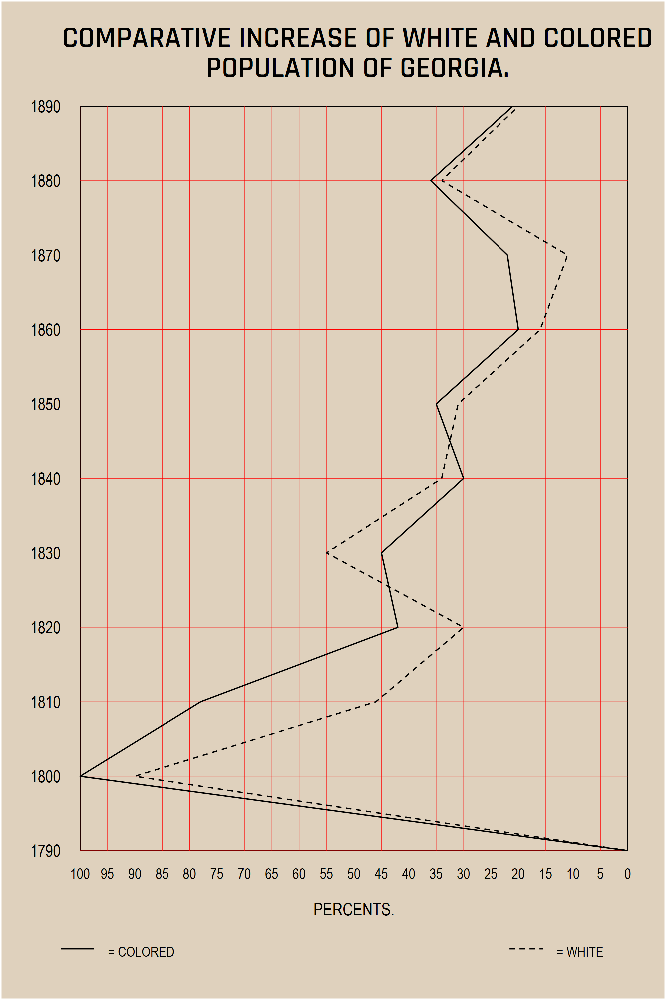
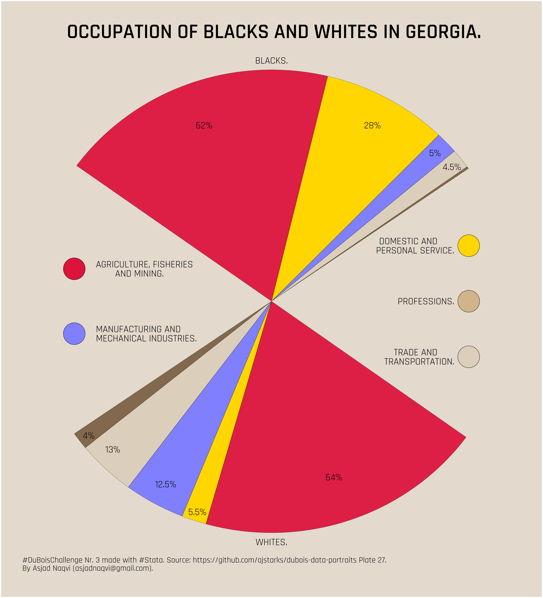
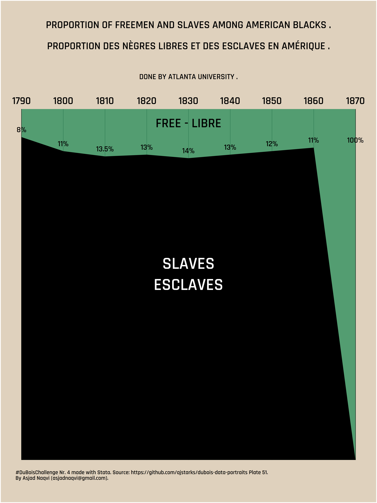
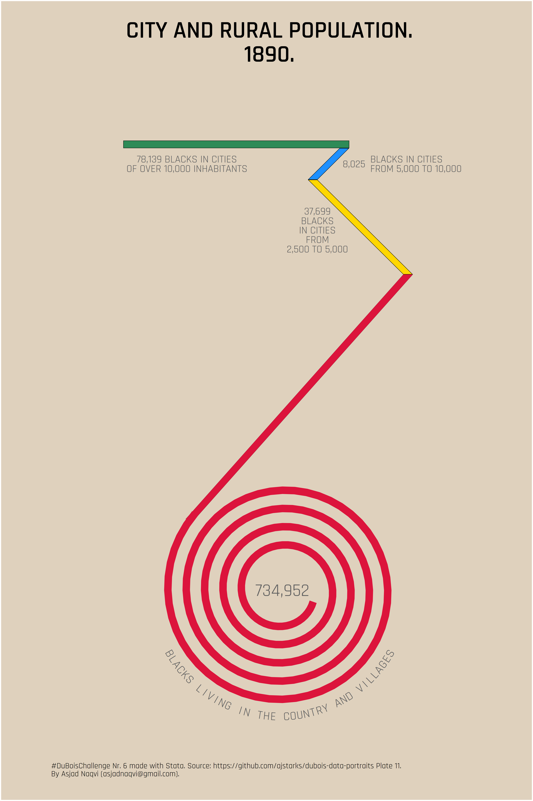
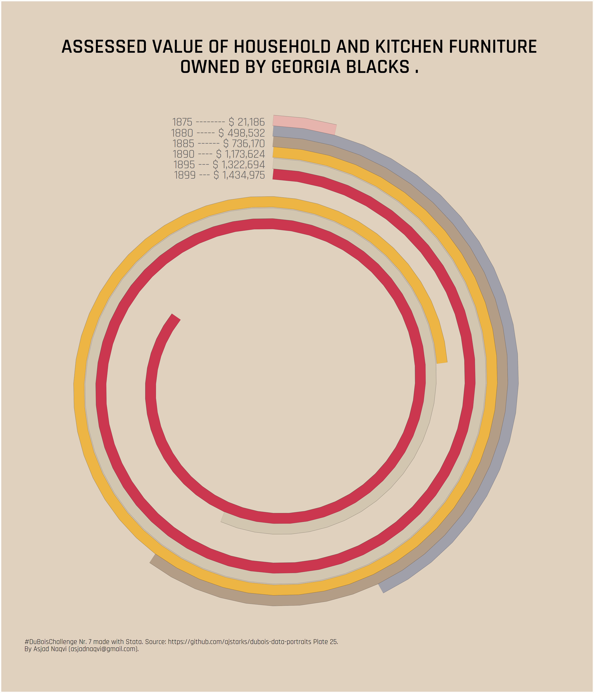

# Du Bois Challenge - The Stata Guide

This repository contains the Stata code for the Du Bois Challenge posted by [ajstarks](https://github.com/ajstarks/dubois-data-portraits/tree/master/challenge). The details of the challenge are given here: https://scatter.wordpress.com/2021/02/22/bringing-communities-together-with-the-duboischallenge/. 

See the Medium article: [**Graph replication: The Du Bois Challenge**](https://medium.com/the-stata-guide/graph-replication-the-du-bois-challenge-f0db93e719e6) for an explaination of the Stata code.

The aim of this challenge is to replicate the powerful hand-drawn visuals produced by Du Bois during his research on the life of the African-American in the USA during the early 1900s. The challenge has 10 plates selected from the complete pool of visualizations that can be found [here](https://github.com/ajstarks/dubois-data-portraits).

In order to produce the visualizations, I am using the [Rajdhani](https://fonts.google.com/specimen/Rajdhani) font from Google Fonts. If you have a better alternative that is closer to the Du Bois typescript, then feel free to replace this one. And please let me know about it as well!

The code below replicates six of the plates. Others might be added later as well. 

I have marked out some of the code blocks from the dofiles. They have been left in there since I use them as intermediary steps to check the outputs. They also help with the learning process. Note that these files might be modified in the future for minor code improvements. Please check here for the latest file or clone the directory.

  

  

  

  

  

  

